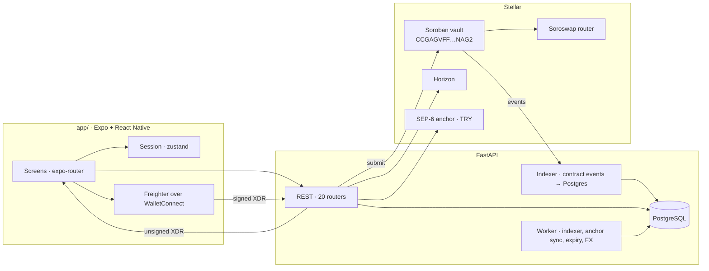

# TraderKirala

**Capital that can be traded but never taken.**

People with savings hand money to traders on trust — a WhatsApp group, a screenshot
of a winning month, a promise. The saver has no custody, no proof and no way out.
TraderKirala gives that arrangement a contract: the capital sits in a Soroban vault,
the trader can swap it but never withdraw it, every trade is bounded by a max-loss
floor the contract enforces, and settlement is arithmetic rather than a promise.

Built for the **Risein Stellar Pro Hackathon**, 19–20 September 2026.

> Investment and commission returns depend on market conditions and carry the risk of
> capital loss. This is testnet software and not financial advice.

---

## Deployed artifacts

| | |
|---|---|
| **Vault contract** | [`CCGAGVFFTH2IIH6WW2E52VVR5TJJFP3OL7HDZUZ2WQ7MT4Z57GA7NAG2`](https://stellar.expert/explorer/testnet/contract/CCGAGVFFTH2IIH6WW2E52VVR5TJJFP3OL7HDZUZ2WQ7MT4Z57GA7NAG2) |
| Network | Stellar **Testnet** (`Test SDF Network ; September 2015`) |
| Contract version | `1.2.0` · wasm `b7fdc81accd2e32c80140831b1c09ce180c78e4889d671aacd6da59de766fb87` |
| Deploy tx | [`857d882e…`](https://stellar.expert/explorer/testnet/tx/857d882ec95b0126aa79f8ccd8d01f6ed974d64bf31150e6846294df28a940ab) |
| Upgrade tx (v1.2.0) | [`89740261…`](https://stellar.expert/explorer/testnet/tx/897402619031058c103e887ca53ed51fa9e0e9a4eac089475dd1c8a3b3d9f54d) |
| Soroswap router | `CCJUD55AG6W5HAI5LRVNKAE5WDP5XGZBUDS5WNTIVDU7O264UZZE7BRD` |
| API | `https://mobilback.yolalapp.com/api/v1` · [OpenAPI](https://mobilback.yolalapp.com/docs) |
| Anchor (TRY ramp) | `tr-mock-anchor.fly.dev` — SEP-6 / SEP-10 / SEP-12 / SEP-38 |

The contract is upgraded in place via `upgrade(wasm_hash)`, so the id above has been
stable across versions.

---

## It works — here is the chain

A complete agreement, executed on testnet during the hackathon:

| Step | What happened | Result |
|---|---|---|
| `reserve` | Customer publishes a 100 XLM listing | 100 XLM leaves the wallet, sits in the vault |
| `open_reserved` | Offer accepted, agreement created | Customer pays **0.468 XLM of network fee — not 100 XLM again** |
| `accept` | Trader confirms | Active, 30-day term |
| `trade` | Swap through Soroswap | 20 XLM → 3.9647321 USDC |
| `settle` | Term closed | **99.8801955 XLM to the customer, 0 commission** — the run lost money |

The anchor moved fiat both ways: **1,000 TRY → 20.3960908 USDC** in, **10 USDC →
485.41 TRY** out. Both reached `completed`.

Nothing in the flow is mocked or hardcoded.

---

## Architecture



**The server never holds a key.** It builds an unsigned transaction envelope, the
wallet signs it on the device, and the app posts the signed envelope back to
`POST /tx/submit`. Every on-chain action in the product follows this one pattern.

### Components

| Component | Responsibility |
|---|---|
| `contracts/vault` | Custody, drawdown enforcement, settlement maths. One singleton holding every agreement and reservation. |
| `app/` | Expo 57 / React Native 0.86. Screens, wallet adapter, signing flow. Types are generated from the server's OpenAPI (`npm run gen:api`). |
| API | 20 routers: auth (SEP-10), users, listings, offers, agreements, trades, wallet, anchor, market, discover, messages, notifications. |
| Indexer | Mirrors contract events into Postgres so screens read a database, not the chain. Runs both inline on `/tx/submit` and in the background worker. |
| Worker | Indexer catch-up, anchor status sync, offer expiry, FX refresh. |

---

## Stellar integrations

**Soroban** — the vault is the product, not an add-on. 26 public functions,
47 passing tests.

```
reserve · release · open · open_reserved · propose · fund · fund_reserved
accept · cancel · trade · settle · claim · upgrade · admin setters · views
```

Storage follows the expected patterns: **persistent** per agreement and per
reservation (TTL bumped on every write), **instance** for config and the token
allow-list. Authorisation is `require_auth` on the party the action belongs to —
`trade` authorises the trader, `fund` the customer, `settle` either party (and
anyone after a 7-day grace, with an in-contract slippage floor instead of trust).

**SEP-6** — a real TRY on/off ramp, chosen over SEP-24 because the TRY anchor
advertises `TRANSFER_SERVER` and no interactive server. Deposit returns bank
instructions the app renders; withdrawal returns the anchor account and memo, and
the app builds the payment for the wallet to sign.
**SEP-10** for anchor auth, **SEP-12** KYC pass-through, **SEP-38** quotes.

**Soroswap** — every swap routes through the allow-listed router. The quote and the
resulting `min_out` are written into the transaction the trader signs, so slippage
is bounded by something the customer can verify afterwards.

**Horizon** — `/trade_aggregations` on **mainnet** powers the market chart.
SEP-10 challenge verification and classic payments also go through Horizon.

**Stellar CLI** — `scripts/deploy_contract.sh` builds, deploys, allow-lists tokens
and records the artifacts in `deploy/contract.testnet.json`.

---

## Key design decisions and trade-offs

**Capital is locked when the listing is published, not when the deal closes.**
Originally a listing was just a number someone typed. Now publishing a capital
listing signs `reserve` and moves the money into the vault; the listing is public
only because the money behind it is already there. The cost is a signature before
anyone has agreed to anything. The gain is that no listing can advertise capital
its owner does not hold.

**The customer never pays twice.** Because the capital is already in the vault,
`open_reserved` / `fund_reserved` move it by accounting only — no token transfer.
Verified on chain: funding a 100 XLM agreement cost the customer 0.468 XLM of
network fee and nothing else.

**A pause must never trap someone's money.** `release` and `cancel` work while the
contract is paused. Only new activity is blocked.

**The trader cannot be trusted, and does not need to be.** `trade` re-values the
portfolio through the router after the swap and rejects anything below the drawdown
floor. `settle` by the trader is additionally floored, so they cannot liquidate into
a bad price to escape a losing position.

**A backend that looks custodial and is not.** Going through our API costs one extra
round trip per action. It buys a mobile app that never sees a secret key, one place
to cache and clean external data, and screens that read a database instead of the
chain.

**Market data comes from mainnet.** Testnet's order book sits at a fake pegged rate
(1 XLM ≈ 1.05 USDC). Mainnet gives 0.19, and the Soroswap testnet pool we actually
execute against gives 0.198 — so mainnet candles represent the price the trader
really gets, and testnet candles would not.

---

## Technical challenges

**Outlier candles made the chart unreadable.** Raw Stellar DEX aggregates contain
single odd trades — one `1 XLM = 1 USDC` fill inside 32,000 trades turned a candle
into a vertical spike. A fixed clip threshold was wrong: 25% was far too loose for a
pair whose real deviation is 1–2%. The threshold is now derived from the window's own
distribution (median deviation × 4), so it adapts per pair and per range.

**Escrow amounts were rounded in the settlement summary.** A 99.8801955 XLM payout
displayed as "100 XLM", which reads as "you got your principal back". Amounts where
the exact figure is the point now use a non-rounding formatter.

**Two parallel chats per counterparty.** Opening a chat and making an offer each
created their own conversation, so the same pair ended up with two inboxes. One
thread per pair now; offers and agreements attach to it.

**A transient 502 logged users out.** On a 401 the app refreshes its token, and the
refresh swallowed every error — so a deploy blip meant "your session ended". Only a
genuine 401/403 from the refresh ends the session now.

**Android edge-to-edge broke the keyboard.** From Expo SDK 54 the window no longer
resizes for the keyboard, so `KeyboardAvoidingView` silently did nothing on Android
and the message composer sat under the keyboard. The app measures the keyboard and
pads the container itself. `Modal` is the exception — it resizes its own window, so
compensating there pushed sheets a keyboard-height too high.

---

## Repository layout

```
traderkirala/
├── app/          Expo + React Native client (this repository)
│   ├── app/          Screens (expo-router)
│   ├── src/          Components, API client, wallet adapter, stores
│   └── scripts/      gen-api-types.py — OpenAPI → TypeScript
├── contracts/    Soroban contracts (Rust) — see note below
├── docs/         Design system and development notes
└── SPRINT-1.md   Sprint plan
```

The server and the Rust contract sources live in a separate deployment repository;
the built contract is on testnet at the id above and the API is public.

---

## Running it

### Client

```bash
cd app
cp .env.example .env          # API base url, contract id, network
npm install
npm run gen:api               # regenerate types from the live OpenAPI
npm run web                   # http://localhost:8081
npm run android               # or: a device over USB with Expo Go
```

Set Freighter to **Testnet** before connecting. On mobile the wallet is reached over
WalletConnect; on web through Stellar Wallets Kit.

Checks: `npm run check` (TypeScript + ESLint), `npm run typecheck`, `npm run lint`.

### Contract

```bash
cd contracts
stellar contract build --package traderkirala_vault
cargo test --package traderkirala_vault        # 47 tests
```

Deploy and allow-list tokens: `scripts/deploy_contract.sh testnet`.

### Evaluating the flow

1. Connect a Freighter testnet wallet and register as a **customer**.
2. Listings → New → publish a capital listing. Signing `reserve` moves the capital
   into the vault; until then the listing stays a draft and is not public.
3. Switch to a second wallet, register as a **trader**, and find that listing in the
   Elevator. Send an offer.
4. Back as the customer: accept, then sign the escrow funding. **Watch the wallet
   balance — only the network fee is deducted.**
5. As the trader: Trades → the market chart → New trade. The quote shows what the
   contract will accept and why a trade would be rejected.
6. Either party settles. The contract splits the result; on a loss the trader is paid
   nothing.

---

## Status and next steps

Working end to end on testnet: wallet auth, listings with on-chain reservations,
offers, chat, agreements, trading, settlement, ratings, the TRY anchor in both
directions, and market charts.

Next: mainnet with a licensed TRY anchor, more pairs, and making a trader's settled
track record portable — a history that belongs to the person rather than to us.
Then passkeys and smart wallets, so a saver never handles a seed phrase.

Intended path: **SCF**.

Honest gap: the product has not been tested with savers outside the team. That is
the first thing after the hackathon, not the last.
