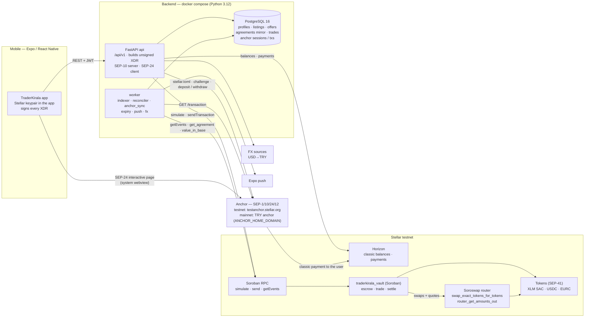
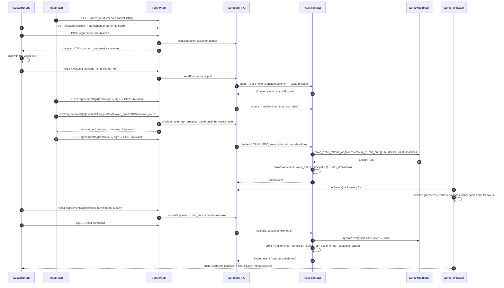
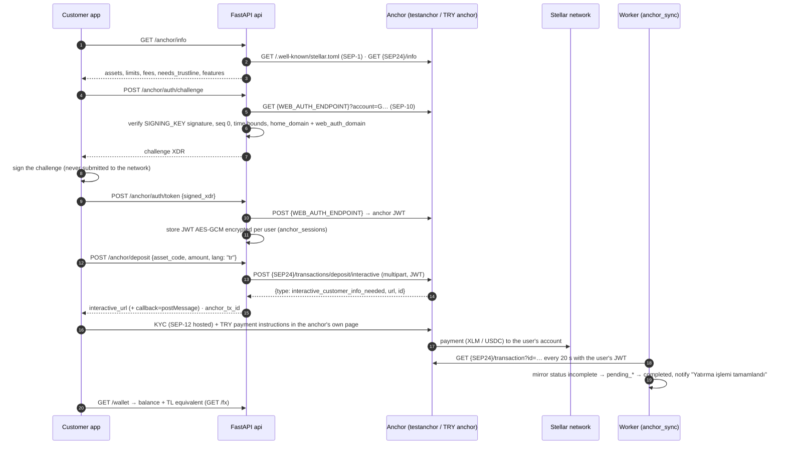

# TraderKirala — rent a trader, keep custody

**Non-custodial capital-management agreements on Stellar.** A customer escrows capital in a Soroban
vault, a vetted trader trades it on **Soroswap** within an on-chain max-drawdown limit, profit is split
by an agreed commission at settlement, and the customer funds / cashes out in **Turkish lira through
a Stellar anchor (SEP-1 / 10 / 24 / 12)**. Capital never leaves the contract until settlement — the
trader can trade it but never withdraw it.

Built for the **Rise In × Stellar Pro Hackathon 2026** (Istanbul, 19–20 Sep 2026). Türkçe özet için
[aşağı](#türkçe-özet) bakın.

| Submission item | Where |
|---|---|
| Public repository | `<GITHUB_REPO_URL>` (this tree; push before 20 Sep 12:00) |
| Live API + OpenAPI docs | `https://mobilback.yolalapp.com/docs` (testnet) |
| Mobile app (Expo) | `<EXPO_EAS_OR_WEB_BUILD_URL>` — screens in `design/figma/` |
| Vault contract (Stellar testnet) | **`CCGAGVFFTH2IIH6WW2E52VVR5TJJFP3OL7HDZUZ2WQ7MT4Z57GA7NAG2`** — [stellar.expert](https://stellar.expert/explorer/testnet/contract/CCGAGVFFTH2IIH6WW2E52VVR5TJJFP3OL7HDZUZ2WQ7MT4Z57GA7NAG2) · artifacts in [`deploy/contract.testnet.json`](deploy/contract.testnet.json) · details in [Smart contract](#smart-contract-traderkirala_vault) |
| Integration partner (handbook req. 1) | **Soroswap** (DeFi – DEX/Swap): every trade and every settlement liquidation goes through the Soroswap router |
| Anchor / local payments (req. 2) | SEP-1 → SEP-10 → **SEP-24** interactive deposit & withdraw (+ SEP-12 when the anchor asks); testnet `testanchor.stellar.org`, mainnet TRY anchor via one env var |
| Core feature (req. 3) | Without Soroswap there is no trading and no settlement; without the anchor there is no TL in/out ([sequence diagrams](#architecture)) |
| Pitch deck (official template) | `<PITCH_DECK_URL>` — outline in [`docs/PITCH.md`](docs/PITCH.md) |
| Stellar Skills used | [cited by path below](#stellar-skills-used) |
| Contract reference | [`docs/CONTRACT.md`](docs/CONTRACT.md) · binding spec [`docs/DESIGN.md`](docs/DESIGN.md) |

---

## Table of contents

1. [Narrative — what, why, for whom](#narrative--what-why-for-whom)
2. [Product flows (Figma screens)](#product-flows-figma-screens)
3. [Architecture](#architecture)
4. [Smart contract](#smart-contract-traderkirala_vault)
5. [Soroswap integration](#soroswap-integration-why-it-is-load-bearing)
6. [Anchor — TRY on/off-ramp](#anchor--try-onoff-ramp)
7. [Backend API](#backend-api)
8. [Mobile signing model](#mobile-signing-model)
9. [Security model & trade-offs](#security-model--trade-offs)
10. [Setup](#setup)
11. [Testing & evaluation](#testing--evaluation)
12. [Stellar Skills used](#stellar-skills-used)
13. [Technical challenges](#technical-challenges)
14. [Roadmap](#roadmap)
15. [Team & submission checklist](#team--submission-checklist)
16. [Türkçe özet](#türkçe-özet)

---

## Narrative — what, why, for whom

**What we are building.** A two-sided marketplace where people with savings ("Müşteri" / customer) hand
capital to independent traders ("Trader") for a fixed term and a profit commission — the way copy-trading
and managed accounts work today, but **without giving anybody custody**. The agreement ("Sözleşme") is a
Soroban contract entry: principal, duration, commission and maximum drawdown are enforced on-chain.

**The problem.** In Turkey, retail investors chasing returns routinely send money to "signal groups" and
self-declared traders through bank transfers or exchange sub-accounts. The trader holds the money; the
investor holds a promise. Losses beyond what was agreed, disappearing traders and unverifiable track
records are the norm. Regulated managed accounts require minimums far above what a retail saver has.

**Who it is for.** Retail savers with ₺10k–₺500k who want exposure to crypto/stablecoin markets without
learning to trade, and skilled traders who want to manage other people's capital without a brokerage
licence and without ever touching client funds.

**Why now / why Stellar.** Escrow with programmable settlement is exactly what Soroban gives us; Soroswap
provides on-chain liquidity for the trades; the anchor network turns a wallet balance into lira and back
so the whole loop — *lira in → capital escrowed → traded → settled → lira out* — closes for a normal
person. The mobile app hides every Stellar concept behind familiar screens (listings, offers, contracts,
"Yatır / Çek").

**Value proposition.**
* Customer: the trader can only *trade* the capital (allow-listed tokens, allow-listed router), never
  withdraw it; the contract rejects any trade that would push the portfolio below `principal × (1 −
  max_drawdown)`; the customer can terminate at any time; losses are capped by design, profit split is
  enforced by code.
* Trader: verifiable on-chain track record (every trade is a `Traded` event), instant settlement of the
  commission, no custody liability.
* Platform: non-custodial by construction (the admin can pause new activity and upgrade, but can never
  move user funds), optional platform fee on profit only.

---

## Product flows (Figma screens)

Source of truth: Figma "TraderKirala Mobil Tasarım Sistemi" (renders in `design/figma/`).

| Screen(s) | Flow | Backend |
|---|---|---|
| **1d–1g** Onboarding (`s1_onboarding.png`) | Stellar wallet login (in-app keypair, Freighter, LOBSTR/xBull) → role choice (customer / trader) → profile (budget, risk profile, markets / strategy, commission, min capital) | `POST /auth/nonce` + `/auth/verify` (or SEP-10 `GET/POST /auth/sep10`), `POST /users/register` |
| **2a–2d** Keşfet (`s2_kesfet.png`) | Swipe deck: customers see trader/service cards, traders see capital listings; like / pass / save / follow; "Teklif Ver" / "Teklif İste" | `GET /discover`, `POST /discover/{type}/{id}/action`, `POST /offers` |
| **3a–3e** Müşteri (`s3_musteri.png`) | Portfolio dashboard (TL equivalents), Hareketler (trades of followed traders / own agreements), trader profile with stats, live positions, ratings | `GET /dashboard`, `GET /activity`, `GET /traders/{id}/profile` |
| **4a/4b** Trader "Yeni İşlem" (`s4_trader.png`) | Quote XLM→USDC with drawdown headroom, sign the `trade`, note + "notify investors" | `GET /agreements/{id}/quote`, `POST /agreements/{id}/tx/trade`, `POST /tx/submit` |
| **5a–5d** İlanlarım (`s5_ilanlarim.png`) | Capital listing (sermaye, süre, piyasa, maks. kayıp, risk profili) / service listing (strateji, komisyon, min sermaye, piyasalar, risk seviyesi); pause / resume / close; offers on my listing | `POST/GET/PATCH /listings`, `/listings/{id}/pause\|resume\|close` |
| **6c/6d** Teklifler | Inbox / outbox, accept → Sözleşme draft + chat thread, reject, withdraw | `GET /offers?box=`, `POST /offers/{id}/accept\|reject\|withdraw` |
| **7a–7c** Bildirimler (`s6_bildirimler.png`) | Tabs by category (listing / offer / agreement / wallet), push via Expo | `GET /notifications`, `/notifications/unread-count`, `PUT /notifications/push-token` |
| **8c** Cüzdan / Yatır / Çek | Balances (classic + Soroban tokens) with TL equivalents, **Yatır / Çek through the anchor** (SEP-24 webview), missing trustlines, recent movements incl. agreement flows | `GET /wallet`, `POST /anchor/deposit\|withdraw`, `GET /anchor/transactions`, `POST /wallet/tx/trustline` |
| **9a–9d** İlan detay / Mesaj / Sözleşme (`s8_ilan_mesaj_sozlesme.png`) | Listing detail, conversation, **Sözleşme lifecycle**: open / propose / fund / accept / cancel / settle with one signature each, value chart, trades, tx hashes | `GET /agreements/{id}`, `POST /agreements/{id}/tx/{action}`, `GET /agreements/{id}/value-history`, `/conversations/*` |
| Profil (`s7_profil.png`) | Profile edit, follow, ratings after settlement | `PATCH /users/me`, `POST /traders/{id}/follow`, `POST /agreements/{id}/rating` |

Amounts are shown in **TL** everywhere via `GET /fx` (USD→TRY, cached, two sources + persisted fallback);
nothing denominated in TL exists on-chain.

---

## Architecture

### Components



| Component | Responsibility |
|---|---|
| **Mobile app** (team, Expo) | Wallet (keypair / Freighter / WalletConnect), all screens, signs every XDR locally, opens SEP-24 pages in a system webview and listens for `postMessage`. |
| **`app/routers` + `app/services`** (FastAPI) | Business rules off-chain (profiles, listings, discovery, offers, messages, ratings, notifications), **unsigned transaction builders** for every on-chain action, `POST /tx/submit` (send + poll), anchor client (SEP-1 discovery, SEP-10 challenge verification, SEP-24 interactive, SEP-12 pass-through), FX. |
| **`app/services/stellar`** | The only place that imports `stellar_sdk`: `SorobanGateway` (RPC: simulate / send / poll / events / contract reads via simulation, `ContractClientAsync` builders), `HorizonGateway` (classic), `contract_abi` (ScVal ↔ `Terms` / `Agreement` / events), `FakeSorobanGateway` for tests. |
| **`app/worker/main.py`** | Supervisor for `indexer` (vault events → mirror, 5 s), `reconciler` (values, snapshots, drawdown / expiry alerts, 60 s), `anchor_sync` (SEP-24 statuses, 20 s), `expiry`, `push`, `fx`. |
| **PostgreSQL** | Everything off-chain plus an **indexed mirror** of on-chain agreements / trades / balances (`onchain_id`, tx hashes, ledgers, event sequence) — never the source of truth for money. |
| **`contracts/vault`** (Soroban, Rust) | Singleton escrow: `propose / open / fund / accept / cancel / trade / settle`, allow-lists, drawdown enforcement, settlement math, events. |
| **`contracts/mock_router`** | Soroswap router subset for `cargo test` only (never deployed for the product). |
| **Soroswap router** (testnet `CCJUD55AG6W5HAI5LRVNKAE5WDP5XGZBUDS5WNTIVDU7O264UZZE7BRD`) | On-chain swaps and quotes used by the vault for `trade`, `settle`, `value_in_base` and by the API for quotes. |
| **Anchor** | Fiat rail: TRY ↔ Stellar asset; KYC; interactive deposit / withdraw pages. |

### Sözleşme (agreement) lifecycle — mobile ⇄ API ⇄ RPC / contract ⇄ Soroswap



Status machine: `draft → (open | propose) → funded | proposed → active → settled`, with `cancel` from
`proposed` (proposer) / `funded` (either party) → `cancelled`. `paused` only blocks new activity;
`settle` and `cancel` always work.

### SEP-24 deposit ("Yatır") — mobile ⇄ API ⇄ anchor ⇄ network



Withdraw ("Çek") is the mirror image: `POST /anchor/withdraw` → interactive page → anchor reaches
`pending_user_transfer_start` with `withdraw_anchor_account` + exact `memo` → `POST
/anchor/transactions/{id}/tx/payment` builds the classic payment → user signs → `POST /tx/submit` →
anchor pays out lira.

### Repository layout

```
app/                 FastAPI backend (routers → services → models), worker, stellar gateway
  core/              settings, errors, security (JWT, AES-GCM)
  models/            SQLAlchemy 2 models (Alembic migration in alembic/versions)
  routers/           auth users listings discover offers agreements tx trades activity dashboard
                     wallet anchor conversations notifications ratings assets config admin meta
  services/          business rules; stellar/{soroban,horizon,contract_abi,sep10,fake}.py; indexer.py; anchor.py
  worker/            main.py (supervisor) · anchor_sync.py
contracts/           Cargo workspace: vault (the product contract) · mock_router (tests only)
docs/                DESIGN.md (binding spec) · CONTRACT.md (contract reference) · PITCH.md · refs/ (skill files)
deploy/              contract.<network>.json (written by scripts/deploy_contract.sh) · nginx/
design/figma/        screen renders the product decisions were derived from
scripts/             deploy_contract.sh · e2e_testnet.py · seed_assets.py · dev.sh · gen_env.py
tests/               pytest (Postgres test DB + in-memory fake vault)
```

---

## Smart contract: `traderkirala_vault`

Rust, `soroban-sdk 28`, protocol 28, `contractmeta binver = 1.0.0`. Full interface, rules, errors and
events: **[`docs/CONTRACT.md`](docs/CONTRACT.md)**. Source: [`contracts/vault/src`](contracts/vault/src)
(`lib.rs`, `types.rs`, `storage.rs`, `router.rs`, `math.rs`, `events.rs`, `errors.rs`, `test.rs`).

### Deployed artifacts (Stellar testnet)

<!-- contract:testnet:begin — filled from deploy/contract.testnet.json (2026-09-19) -->
| Item | Value |
|---|---|
| Contract id | **`CCGAGVFFTH2IIH6WW2E52VVR5TJJFP3OL7HDZUZ2WQ7MT4Z57GA7NAG2`** (`deploy/contract.testnet.json` → `contract_id`, `.env` → `VAULT_CONTRACT_ID`) |
| Explorer | [stellar.expert/explorer/testnet/contract/CCGAGVFFTH2IIH6WW2E52VVR5TJJFP3OL7HDZUZ2WQ7MT4Z57GA7NAG2](https://stellar.expert/explorer/testnet/contract/CCGAGVFFTH2IIH6WW2E52VVR5TJJFP3OL7HDZUZ2WQ7MT4Z57GA7NAG2) |
| Deploy tx (constructor) | [`857d882e…a940ab`](https://stellar.expert/explorer/testnet/tx/857d882ec95b0126aa79f8ccd8d01f6ed974d64bf31150e6846294df28a940ab) · wasm upload [`7360f9d3…626fdc`](https://stellar.expert/explorer/testnet/tx/7360f9d3206e919df2b3a923ec6b5dba5d3c39f541c13c5afec56e397f626fdc) |
| Wasm | `contracts/target/wasm32v1-none/release/traderkirala_vault.wasm` (31,835 bytes), sha256 `800b4473dd187e475e1d53e2bd2f82365c21670c54a5901abfb25e87cdf7f991` (`deploy/contract.testnet.json` → `wasm_sha256`) |
| Admin / fee recipient | platform account `GCQHL377VFSG4MLLBEWX33CC3S7T5QAGWOD64A5BH4OOWWD3XWYDKHZH` |
| Router | Soroswap testnet `CCJUD55AG6W5HAI5LRVNKAE5WDP5XGZBUDS5WNTIVDU7O264UZZE7BRD` |
| Constructor | `platform_fee_bps = 0`, `settle_slippage_bps = 100` |
| Allow-list txs (`set_token`) | XLM [`b5b8b376…650bb2`](https://stellar.expert/explorer/testnet/tx/b5b8b3764cde59a1483391fc41e407953b262c34d6f77e0fc9b778d8f0650bb2) · USDC (Circle testnet) [`e640328b…dcafac`](https://stellar.expert/explorer/testnet/tx/e640328b3bb0cd765c6e7857de3a30f0d607d234cb9cb7a7013ad305d9dcafac) · USDC (Soroswap test) [`9984cf54…8766c5`](https://stellar.expert/explorer/testnet/tx/9984cf543e2b351d8ce58574d3602aa811d3b9bdc6df22af68156a4a118766c5) · EURC (Soroswap test) [`f86af43a…6bd4f9`](https://stellar.expert/explorer/testnet/tx/f86af43a3a6437eba6c75ea7d0e84353a90271bab5be36507dc7aaddd96bd4f9) |
| Deployed at | 2026-09-19T19:17:15Z (post-review build; earlier build CBQYSVTE… superseded) |
<!-- contract:testnet:end -->

Print the live values: `python3 -c 'import json;d=json.load(open("deploy/contract.testnet.json"));print(d["contract_id"], d["wasm_sha256"])'`.
The API also exposes them at `GET /api/v1/config` (`vault_contract_id`, `contract.*` read live from the chain).

Allow-listed tokens on testnet (`set_token`): XLM SAC `CDLZFC3SYJYDZT7K67VZ75HPJVIEUVNIXF47ZG2FB2RMQQVU2HHGCYSC` (base),
Circle USDC SAC `CBIELTK6YBZJU5UP2WWQEUCYKLPU6AUNZ2BQ4WWFEIE3USCIHMXQDAMA` (base, anchor-delivered),
Soroswap test USDC `CB3TLW74NBIOT3BUWOZ3TUM6RFDF6A4GVIRUQRQZABG5KPOUL4JJOV2F` (base, AMM liquidity),
Soroswap test EURC `CBQDUWBOHS7P4TZIJ3KUPUZQOWMKJC6CQPPFEONSV3BH4X27YVEXWNOT` (trade only).

### What it does

| Function | Auth | Effect |
|---|---|---|
| `open(customer, terms) → id` | customer (+ inner SAC `transfer`) | escrows `principal`, status **Funded** |
| `propose(trader, terms) → id` | trader | trader-initiated agreement, status **Proposed** (customer `fund`s later) |
| `fund(id)` / `accept(id)` | stored customer / stored trader | → **Active**, `start_time`/`end_time` set |
| `cancel(id, caller)` | proposer (Proposed) or either party (Funded) | refunds the principal, **Cancelled** |
| `trade(id, token_in, token_out, amount_in, min_out, deadline) → out` | stored trader | swap through the allow-listed router; **rejected if `value_after < principal × (1 − max_drawdown)`** |
| `settle(id, caller, min_outs)` | party any time (auth) · anyone after `end_time` | liquidates to base, `profit = max(0, final − principal)`, `trader_fee = profit × commission`, `platform_fee`, `customer_payout = final − fees`; **Settled** |
| views | none | `get_agreement`, `get_balances`, `value_in_base`, `get_config`, `is_token_allowed`, `next_id` |
| admin | `config.admin` | `set_token`, `set_router`, `set_fees (≤ 10 % of profit)`, `set_paused`, `set_settle_slippage`, `upgrade` |

### Soroban auth & storage patterns (judging criterion "implemented appropriately")

* **Authorization from storage.** Every privileged path loads the authorising address from storage
  (`terms.customer` / `terms.trader` / `proposer` / `config.admin`) and calls `require_auth()` on *that*;
  the only free-parameter `require_auth`s are on creation (checked against `terms`) and `caller` on
  `cancel` / `settle` (checked against the stored parties).
* **Contract-authorised sub-invocations.** For `trade` and `settle` the vault pre-authorises
  `token_in.transfer(vault → pair, amount)` with `authorize_as_current_contract` before calling the router,
  so the router pulls funds from the vault without any user signature on the inner call; the credited
  amount is re-verified against the real balance delta.
* **One signature per action.** Transactions are built with **source account = the user**, so the
  simulation's auth entries use source-account credentials and a single envelope signature covers both
  the classic tx and the Soroban auth tree (`docs/CONTRACT.md §7`).
* **Typed storage keys** (`DataKey::{Config, NextId, Agreement(id), Balance(id, token), AllowedToken}`),
  **instance** storage for config / allow-list, **persistent** for agreements and balances, TTL bumped
  30 d → 120 d in every hot path; balances are removed (not zeroed) when a token is fully exited.
* `__constructor`, typed `#[contracterror]` codes (1–17, ABI-stable), `#[contractevent]` for every state
  change, checked i128 math, bounded loops (`MAX_TOKENS = 6`), `amount ≤ 0` rejected, `upgrade` gated by
  admin with `contractmeta!(binver)`.
* 35 `cargo test`s: both lifecycle paths with exact `env.auths()` trees and XDR-compared events, wrong-signer
  negatives for every mutating function, pause semantics, allow-list, `MAX_TOKENS`, slippage / drawdown
  rollback, settle profit / loss / zero, permissionless post-expiry settle, TTL assertions, 20 000-case
  settlement-math invariants.

---

## Soroswap integration (why it is load-bearing)

Soroswap is the **only path money moves inside an agreement**:

| Where | Call | Purpose |
|---|---|---|
| `vault::trade` | `router_pair_for`, `swap_exact_tokens_for_tokens(amount_in, min_out, [in, out], vault, deadline)` | the trader's every position change |
| `vault::settle` | `swap_exact_tokens_for_tokens` per non-base token | liquidation back to the base token before payout |
| `vault::value_in_base`, drawdown check | `router_get_amounts_out(balance, [token, base])` | portfolio valuation the max-drawdown rule is enforced on |
| API `GET /agreements/{id}/quote`, `tx/trade`, `tx/settle` | same router functions via RPC **simulation** (+ optional Soroswap API quote when `SOROSWAP_API_KEY` is set) | `min_out` / `min_outs` for the user's slippage, headroom preview before signing |
| `contracts/vault/src/router.rs` | `SoroswapRouter` client trait | interface verified against `soroswap/core/contracts/router/src/lib.rs` |

Remove Soroswap and the product has no trading, no valuation and no settlement. The router address is
allow-listed in the contract config (`set_router`), and only tokens with a direct Soroswap pool against
every base token are allow-listed (`set_token`), because settlement liquidates through `[token, base]`.

Testnet reality: Soroswap liquidity exists for **XLM ↔ its own test USDC / EURC**, so the **testnet default
base asset is XLM**; Circle's USDC SAC (what the anchor delivers) is allow-listed as base but has no AMM
pool on testnet. On mainnet the base asset is Circle USDC, delivered by USD/TRY anchors and traded on
Soroswap (`CAG5LRYQ5JVEUI5TEID72EYOVX44TTUJT5BQR2J6J77FH65PCCFAJDDH`).

---

## Anchor — TRY on/off-ramp

Goal: the customer funds the app wallet with **lira** and cashes out to lira without the platform ever
touching fiat. The anchor holds the licence; we integrate its standard SEP endpoints
(`app/services/anchor.py`, `app/routers/anchor.py`, `app/worker/anchor_sync.py`).

| Step | Standard | Implementation |
|---|---|---|
| Discovery | **SEP-1** | `fetch_stellar_toml_async(ANCHOR_HOME_DOMAIN)` → `WEB_AUTH_ENDPOINT`, `TRANSFER_SERVER_SEP0024`, `KYC_SERVER`, `SIGNING_KEY`, `CURRENCIES`; `NETWORK_PASSPHRASE` must match ours; `GET {SEP24}/info` → `GET /api/v1/anchor/info` (assets, min/max, fees, `features`) |
| Auth | **SEP-10** (user-signed) | `POST /anchor/auth/challenge` fetches the challenge, **verifies** the anchor signature, `seq = 0`, time bounds, `home_domain` and `web_auth_domain` (`read_challenge_transaction`), hands it to the app; the app signs; `POST /anchor/auth/token` exchanges it and stores the anchor JWT **AES-GCM encrypted** per user — the JWT never reaches the mobile, the challenge is never submitted to the network |
| Deposit (Yatır) | **SEP-24** interactive | `POST /anchor/deposit {asset_code, amount, lang}` → `POST {SEP24}/transactions/deposit/interactive` (multipart, JWT) → `interactive_url` (+ `callback=postMessage`) opened in a **system webview**; funds arrive as a classic payment |
| Withdraw (Çek) | **SEP-24** interactive | `POST /anchor/withdraw` → interactive page → `pending_user_transfer_start` with `withdraw_anchor_account`, `withdraw_memo`, `withdraw_memo_type` → `POST /anchor/transactions/{id}/tx/payment` builds the exact payment → sign → `POST /tx/submit` |
| KYC | **SEP-12** | handled by the anchor's hosted page; optional server-side pass-through `POST /anchor/kyc` (only the customer id is stored, no PII) |
| Tracking | SEP-24 `GET /transaction` | worker `anchor_sync` every 20 s per user session; statuses mirrored as a state machine (`incomplete, pending_user_transfer_start, pending_anchor, pending_trust, pending_user, on_hold, completed, refunded, expired, error…`); notifications "Yatırma işlemi tamamlandı / Çekim tamamlandı"; `GET /anchor/transactions` feeds the wallet's "Son işlemler"; a rejected/expired JWT flags `needs_reauth` and the app re-runs SEP-10 transparently |
| Trustlines | classic | `GET /wallet` reports missing trustlines for anchor assets; `POST /wallet/tx/trustline` builds the `change_trust` |

**Testnet demo:** `testanchor.stellar.org` (assets `native` XLM, `USDC`, `SRT`). **Mainnet:** the TRY anchor
presented at the hackathon workshop is a single config value — `ANCHOR_HOME_DOMAIN=<try-anchor-domain>`,
`ANCHOR_ASSETS=USDC,TRY…` — no code changes, because everything above is driven by the anchor's own
`stellar.toml` and `/info`. TL amounts are shown everywhere through `GET /fx`.

Anchor-skill gotchas respected (from `CheesecakeLabs/stellar-anchor-skill`): never submit the SEP-10
challenge; pass `home_domain` and `web_auth_domain` separately; open SEP-24 URLs in a system webview (not an
iframe) and listen for `postMessage`; withdrawals use the anchor's exact `memo` / `memo_type`; check `/info`
(`features.claimable_balances = false` on testanchor → trustline before non-native deposits); amounts are
decimal strings; transaction status is a state machine; re-run SEP-10 on 401; always pair `asset_code` with
`asset_issuer`.

---

## Backend API

FastAPI, prefix `/api/v1`, OpenAPI at `/docs`. JWT bearer from `/auth/*`; errors are uniform
`{"code","message","details"}`. All amounts are decimal strings (7 dp); on-chain `i128` stroops conversion
lives in one helper (`app/services/amounts.py`).

| Area (Figma) | Endpoints |
|---|---|
| Meta | `GET /health`, `GET /health/stellar`, `GET /api/v1/config` (network, passphrase, RPC/Horizon, `vault_contract_id`, router, allow-listed tokens, live contract config, anchor + auth parameters), `GET /fx`, `GET /fx/convert` |
| Auth (1d) | `GET /auth/sep10?account=`, `POST /auth/sep10`, `POST /auth/nonce`, `POST /auth/verify`, `GET /auth/me`, `POST /auth/refresh` |
| Users (1e–1g, 3e) | `POST /users/register`, `GET/PATCH /users/me`, `GET /users/{id}`, `GET /users/by-username/{u}`, `GET /traders`, `GET /traders/{id}/profile`, `POST/DELETE /traders/{id}/follow`, `GET /traders/{id}/ratings` |
| Discover (2a–2d) | `GET /discover`, `GET /discover/remaining`, `POST /discover/{listing\|user}/{id}/action {pass\|like\|save\|follow\|offer_request}`, `DELETE /discover/listing/{id}/save` |
| Listings (5a–5d, 9a) | `POST /listings`, `GET /listings`, `GET /listings/mine`, `GET /listings/mine/counts`, `GET /listings/saved`, `GET /listings/{id}`, `PATCH /listings/{id}`, `POST /listings/{id}/pause\|resume\|close` |
| Offers (2d, 6c/6d) | `POST /offers`, `GET /offers?box=inbox\|outbox&status=`, `GET /offers/stats`, `GET /offers/{id}`, `POST /offers/{id}/accept` (→ agreement draft + conversation + `next_action`), `POST /offers/{id}/reject\|withdraw` |
| Agreements / Sözleşme (9d, 3a, 5c) | `GET /agreements?role=&status=`, `GET /agreements/{id}` (terms, status, balances, value, P&L, tx hashes, TL, `available_actions`), **`POST /agreements/{id}/tx/{open\|propose\|fund\|accept\|cancel\|settle}`** → unsigned XDR, `GET /agreements/{id}/trades`, `GET /agreements/{id}/value-history?range=`, `POST/GET /agreements/{id}/rating` |
| Trading (4a/4b) | `GET /agreements/{id}/quote?token_in&token_out&amount_in&slippage_bps`, **`POST /agreements/{id}/tx/trade`**, `PATCH /trades/{id}` (note), `GET /activity` |
| Tx (signing model) | **`POST /tx/submit {pending_tx_id, signed_xdr}`** → `{tx_hash, status, result, contract_error, events…}`, `GET /tx/{pending_id}` |
| Wallet (8c) | `GET /wallet`, `GET /wallet/deposit-info`, `POST /wallet/tx/payment`, `POST /wallet/tx/trustline` |
| Anchor (8c Yatır / Çek) | `GET /anchor/info`, `GET /anchor/auth/session`, `POST /anchor/auth/challenge`, `POST /anchor/auth/token`, `POST /anchor/deposit`, `POST /anchor/withdraw`, `GET /anchor/transactions`, `GET /anchor/transactions/{id}`, `POST /anchor/transactions/{id}/tx/payment`, `POST /anchor/kyc` |
| Dashboard (3a, 5c) | `GET /dashboard` (role-aware) |
| Messages (9b/9c) | `GET /conversations`, `GET /conversations/unread-count`, `GET /conversations/{id}`, `GET/POST /conversations/{id}/messages`, `POST /conversations/{id}/read` |
| Notifications (7a–7c) | `GET /notifications`, `GET /notifications/unread-count`, `POST /notifications/read`, `POST /notifications/{id}/read`, `PUT /notifications/push-token` |
| Assets | `GET /assets`, `GET /assets/{id}` |
| Admin (`X-Admin-Key`) | `GET /admin/stats`, `GET/PATCH /admin/users`, `GET/POST/PATCH /admin/assets`, `POST /admin/assets/sync-onchain` (reads `is_token_allowed`), `GET /admin/agreements`, `GET /admin/indexer`, `POST /admin/indexer/reset`, `GET /admin/contract/config`, `POST /admin/contract/tx/{set_token\|set_paused\|set_fees\|set_router\|set_settle_slippage}`, `POST /admin/contract/tx/submit` |

---

## Mobile signing model

Every state-changing on-chain action is three calls and **one signature**:

```
POST /agreements/{id}/tx/{action}  ─▶  { pending_tx_id, unsigned_xdr, network_passphrase, tx_hash, source, expires_at, summary }
app: TransactionBuilder.fromXDR(unsigned_xdr, passphrase).sign(keypair)        # source = the user
POST /tx/submit { pending_tx_id, signed_xdr }  ─▶  { tx_hash, status: SUCCESS|FAILED|PENDING, contract_error, events }
```

* The backend **simulates and assembles** the transaction (`ContractClientAsync` / `prepare_transaction`)
  with the user's account as source, so the Soroban auth entries use source-account credentials — the
  envelope signature is the authorisation. The backend never holds user keys.
* `summary` tells the user what they are signing ("open: escrow 50 XLM for 1 day, commission 20 %, max
  drawdown 50 %"); `expires_at` is the envelope time bound; `pending_transactions` tracks
  `built → submitted → success | failed | expired` and the indexer reconciles rows the client never
  reported back.
* `POST /tx/submit` sends via RPC and polls up to 60 s; `FAILED` carries the decoded contract error
  (`DrawdownBreached`, `SlippageExceeded`, …); `PENDING` means keep polling `GET /tx/{id}`.
* The same pattern serves classic payments (`/wallet/tx/payment`, anchor withdraw leg) and trustlines.
* Fees: the user pays (friendbot on testnet). Fee-bump sponsorship is on the roadmap.

---

## Security model & trade-offs

| Decision | Why | Trade-off |
|---|---|---|
| Single audited-style vault contract escrows every agreement | one code path to review, upgradeable, per-agreement persistent entries | admin `upgrade` has full power over future behaviour → operational mitigation (multisig admin, announced upgrades), listed as a known trust assumption |
| Admin can pause / allow-list / set fees ≤ 10 % of profit, **cannot move funds or block `settle` / `cancel`** | non-custodial promise must hold even against the platform | a de-listed token still inside an agreement is liquidated at settlement through the router; recovery is `set_router` or liquidity, never a fund freeze |
| Max drawdown enforced **at trade time** from router quotes | protects the customer without a keeper | same-transaction quotes cannot detect a sandwich that already moved the pool; slippage protection comes from off-chain simulated `min_out`; a colluding trader + MEV searcher is the residual risk (losses stay with the customer, who may settle any time) |
| Trader signs every trade; backend only builds XDR | no hot keys on the server, every trade is an on-chain event with the trader's signature | a trader must be online to trade; no automated strategies in v1 |
| Post-expiry `settle` is permissionless with in-contract floors | liveness: capital can never be stuck | keeper floor = `quote × (1 − settle_slippage_bps)`, parties get better execution by settling themselves with simulated `min_outs` |
| Fee legs use `try_transfer`, redirected to the customer if unreceivable | a missing trustline must not block a settlement | the trader/platform must keep trustlines for base tokens to receive fees |
| Anchor JWT stored AES-GCM encrypted, never sent to the app; challenge verified server-side; `ANCHOR_HOME_DOMAIN` pinned; anchor endpoints rate-limited | the anchor session is the user's fiat identity | the backend cannot re-run SEP-10 on its own — the app is asked to re-sign when a session expires |
| Off-chain mirror in Postgres | fast feeds, TL equivalents, notifications | never the source of truth: the API refreshes open agreements from the contract on read, the reconciler re-syncs status every 60 s |
| SEP-10 (`/auth/sep10`) **and** a nonce login | SEP-10 for wallet apps, nonce for in-app keys | two auth paths to maintain |
| TL display via an FX service, nothing in TL on-chain | anchors settle in XLM/USDC; TRY tokens on Stellar are anchor-specific | displayed TL values are indicative (USD/TRY + XLM/USD from the router) |

---

## Setup

### Server (what runs at `mobilback.yolalapp.com`)

```bash
git clone <GITHUB_REPO_URL> mobilapp && cd mobilapp
python3 scripts/gen_env.py --domain mobilback.yolalapp.com > .env   # fresh secrets: JWT, admin key, SEP-10 + platform keys, AES key
sudo docker compose build api
sudo docker compose up -d db api worker      # api entrypoint: alembic upgrade head + scripts.seed_assets, then uvicorn; worker = python -m app.worker.main
curl -s localhost:8012/health && curl -s localhost:8012/api/v1/config | jq .vault_contract_id
```

nginx (`deploy/nginx/mobilback.yolalapp.com`) terminates TLS and proxies `127.0.0.1:8012`.

Key environment variables (`app/core/config.py`):

| Variable | Default | Meaning |
|---|---|---|
| `STELLAR_NETWORK` | `testnet` | `testnet` \| `public`; RPC / Horizon / friendbot / router defaults follow |
| `VAULT_CONTRACT_ID` | – | written by `scripts/deploy_contract.sh` |
| `SOROSWAP_ROUTER_ID`, `SOROSWAP_API_KEY` | per-network router, none | router used for quotes; optional Soroswap API quotes |
| `DEFAULT_BASE_ASSET_CODE` | `XLM` | testnet (Soroswap liquidity); `USDC` on mainnet |
| `ANCHOR_ENABLED`, `ANCHOR_HOME_DOMAIN`, `ANCHOR_ASSETS`, `ANCHOR_LANG` | `true`, `testanchor.stellar.org`, `native,USDC`, `tr` | the fiat rail; switch to the TRY anchor here |
| `SEP10_SERVER_SECRET`, `HOME_DOMAIN`, `WEB_AUTH_DOMAIN` | – | our own SEP-10 server for wallet login |
| `PLATFORM_SECRET` | – | contract admin / fee recipient (signs admin txs only) |
| `POOL_KEY_ENCRYPTION_KEY` | – | AES-GCM key for anchor JWTs |
| `INDEXER_POLL_SECONDS`, `RECONCILE_SECONDS`, `ANCHOR_SYNC_SECONDS`, `FX_CACHE_SECONDS` | 5, 60, 20, 600 | worker intervals |
| `EXPO_PUSH_ENABLED`, `EXPO_ACCESS_TOKEN` | `false` | push notifications |

### Local development

```bash
scripts/dev.sh py -c "import app.main"        # anything inside the real python:3.12 image (source live-mounted)
scripts/dev.sh ruff                           # ruff check app tests scripts
scripts/dev.sh alembic upgrade head
scripts/dev.sh test -q                        # pytest against the mobilapp_test database
scripts/dev.sh py -m app.worker.main --list   # job table; `--once indexer fx` runs single ticks and exits
```

### Contracts

```bash
cd contracts
cargo test                                    # 37 tests (34 vault + 3 mock router), snapshots in */test_snapshots
stellar contract build --package traderkirala_vault   # → target/wasm32v1-none/release/traderkirala_vault.wasm
cd .. && scripts/deploy_contract.sh testnet   # build → deploy (constructor) → set_token allow-list → deploy/contract.testnet.json + VAULT_CONTRACT_ID in .env
sudo docker compose up -d --force-recreate api  # pick up VAULT_CONTRACT_ID
curl -s -X POST -H "X-Admin-Key: $ADMIN_KEY" localhost:8012/api/v1/admin/assets/sync-onchain   # mirror the allow-list into `assets`
```

Toolchain: `stellar` CLI 28, Rust 1.85+ (`rustup target add wasm32v1-none`). The Soroban SDK 28 wasm build
goes through `stellar contract build` (plain `cargo build --target wasm32v1-none` is refused).

---

## Testing & evaluation

| Layer | Command | What it proves |
|---|---|---|
| Contract | `cd contracts && cargo test` | lifecycle, auth trees (`env.auths()`), events, pause, allow-list, slippage / drawdown rollback, settlement math invariants (20 k cases), TTL |
| Backend | `scripts/dev.sh test -q` | API flows per screen against Postgres + `FakeSorobanGateway` (in-memory vault mirroring the contract semantics incl. settlement math), indexer with synthetic events, worker jobs (`tests/test_worker.py`), anchor client with mocked HTTP, property test that the Python settlement math equals the contract formula |
| Live RPC | `LIVE_STELLAR=1 scripts/dev.sh test tests/test_soroban_live.py -q -s` | real Soroswap router quotes, router events and the deployed vault's `get_config` / `next_id` on testnet through `SorobanGateway` |
| **End to end on testnet** | `API_BASE=http://127.0.0.1:8012 python scripts/e2e_testnet.py [--anchor]` | two friendbot-funded keypairs: nonce login → register → listings → offer → accept → **`open` (50 XLM escrowed) → `accept` → Soroswap quote → `trade` 10 XLM→USDC → `settle`**, every XDR signed locally exactly like the app; waits for the indexer, checks `final = payout + fees`, prints tx hashes with stellar.expert links; `--anchor` adds SEP-1 → SEP-10 (challenge signed locally) → SEP-24 interactive deposit against `testanchor.stellar.org` and lists the anchor transactions (the interactive page is printed for a human to finish); `--dry-run` prints the plan |

### Verified on testnet (19 Sep 2026, `scripts/e2e_testnet.py --anchor` against this API)

| Step | Testnet evidence |
|---|---|
| Vault contract | [`CCGAGVFFTH2IIH6WW2E52VVR5TJJFP3OL7HDZUZ2WQ7MT4Z57GA7NAG2`](https://stellar.expert/explorer/testnet/contract/CCGAGVFFTH2IIH6WW2E52VVR5TJJFP3OL7HDZUZ2WQ7MT4Z57GA7NAG2), on-chain agreement id **1** |
| `open` — customer escrows 50 XLM (`Opened`) | [`b9fdf16f…77e1a`](https://stellar.expert/explorer/testnet/tx/b9fdf16ffcc8cdcb330f952782d9e4365bf45f9c0aba9c3d62f56ac283777e1a) |
| `accept` — trader activates (`Activated`) | [`46cc85ca…6eeaf`](https://stellar.expert/explorer/testnet/tx/46cc85ca6d8e218222c2bc06a6fe1e8938f8c9846328668543152e58e286eeaf) |
| `trade` — 10 XLM → 2.8963687 USDC through the **Soroswap** router (`Traded`, value_after 49.9401338) | [`3464fd09…91356`](https://stellar.expert/explorer/testnet/tx/3464fd09bed2d44d2225b5edb3689f63f6c79b73ceacefbe6fff0d11d8691356) |
| `settle` — USDC liquidated back via Soroswap, payout 49.9401338 XLM to the customer, fees 0 (no profit) (`Settled`) | [`8c09f2aa…e663f`](https://stellar.expert/explorer/testnet/tx/8c09f2aa11897a75b2f2a23d549943ecf7cc561ac5b4af2ec52c42f7f09e663f) |
| Anchor — SEP-1 discovery, SEP-10 challenge signed locally (never submitted), SEP-24 interactive deposit started on `testanchor.stellar.org` | anchor transaction `a962955f-4f8b-4f83-bd17-5923a0af5d12` (`status=incomplete`, interactive URL returned; the hosted form is the human step) |

Every XDR above was built by the API with source = the user, signed by the script's local keypairs exactly
like the mobile app does, and submitted through `POST /api/v1/tx/submit`; the worker's indexer mirrored the
`Opened / Activated / Traded / Settled` events into `agreements` / `trades`.

How judges can evaluate without the app: open `https://mobilback.yolalapp.com/docs`, run the e2e script
against it (`API_BASE=https://mobilback.yolalapp.com python scripts/e2e_testnet.py --anchor`), then follow
the printed `stellar.expert` links to the `Opened`, `Activated`, `Traded` and `Settled` events on testnet.

---

## Stellar Skills used

Cited by path as the handbook requires (local copies of the third-party files in `docs/refs/`):

* `stellar/stellar-dev-skill` — `skills/smart-contracts/SKILL.md`, `skills/smart-contracts/development.md`
  (storage / TTL, authorization, cross-contract calls, tokens, events, errors, upgrades),
  `skills/smart-contracts/security.md` (the checklist behind §1.5 of the design and `docs/CONTRACT.md §7`),
  `skills/smart-contracts/testing.md` (auth-tree and event assertions, property tests, snapshots),
  `skills/data/SKILL.md` (RPC `getEvents` / `getTransaction` / simulation reads for the indexer),
  `skills/standards/SKILL.md` (which SEP for what: SEP-1/10/12/24, SEP-41 tokens, SEP-7 pay URIs),
  `skills/dapp/SKILL.md` (transaction building, simulation, signing and submission from the client side).
* Anchors — `CheesecakeLabs/stellar-anchor-skill/SKILL.md` with
  `references/client/discovery-and-auth.md`, `references/client/sep24-interactive.md`,
  `references/testing/testing-and-validation.md` (the SEP-1 → SEP-10 → SEP-24 client, gotchas listed above).
* Soroswap — `soroswap/sdk/skills/soroswap-sdk/SKILL.md`; the router interface used from the contract was
  verified against `soroswap/core/contracts/router/src/lib.rs`.

---

## Technical challenges

1. **One signature for a Soroban call with an inner token transfer.** `open` / `fund` need the customer to
   authorise both the vault call and the SAC `transfer` sub-invocation. Building the transaction with the
   user as source account makes the simulation emit source-account credentials, so the envelope signature
   covers the whole auth tree — no separate auth-entry signing on the phone.
2. **Who cancels a Funded agreement?** Soroban has no "try require_auth", and either party may cancel, so
   `cancel(id, caller)` takes the authorising address and checks it against the stored parties (documented
   deviation in `docs/CONTRACT.md §11`).
3. **Permissionless settle without a slippage hole.** After `end_time` anyone may settle, but an unsigned
   `settle(id, customer, [0,…])` would bypass floors. Parties always sign and supply `min_outs`; non-party
   callers get in-contract floors `quote × (1 − settle_slippage_bps)`.
4. **Router output cannot be trusted.** The credited amount is `min(router-reported, actual balance delta)`
   and must be `≥ min_out`, and a lenient mock router test proves the vault-side re-check.
5. **Two USDCs on testnet.** The anchor delivers Circle's USDC (no Soroswap pool); Soroswap's test USDC has
   liquidity but is a different contract. Assets are keyed by `contract_id`, quotes/trades accept contract
   ids, and the testnet base asset is XLM so the whole loop works today; mainnet flips to Circle USDC.
6. **Indexer idempotency and missed events.** Trades are unique on `(tx_hash, event index)`, agreements are
   matched to drafts by `listing_ref` (sha256 of the offer id) and otherwise created from chain state; the
   reconciler re-syncs status from `get_agreement` so a missed event never leaves the mirror stale.
7. **Anchor sessions without user keys on the server.** The backend cannot re-run SEP-10 by itself; a
   rejected JWT flags `needs_reauth` and the app re-signs a fresh challenge transparently.
8. **Toolchain drift.** soroban-sdk 28 refuses a plain `cargo build --target wasm32v1-none`; `stellar contract
   build` is used everywhere; `update_current_contract` replaced the older upgrade API; SQLAlchemy silently
   drops a `use_alter` FK inside `create_table`, so the migration adds it explicitly; pytest-asyncio 1.x needs
   a session-scoped loop for the shared asyncpg engine.

---

## Roadmap

| When | Item |
|---|---|
| Post-hackathon (next step: **SCF / InstAward** application) | Passkeys / smart accounts via **Smart Account Kit** (`C…` smart-wallet users, biometric signing, no seed phrases); **fee sponsorship** with fee-bump transactions / OpenZeppelin relayer so customers never need XLM for fees |
| Q4 2026 | **SEP-38 quotes** (firm TRY↔USDC quotes before deposit / withdraw), **mainnet TRY anchor** (config switch + SEP-12 fields the anchor requires), Circle USDC as the mainnet base asset |
| Q4 2026 | Trader automation: strategy bots signing with delegated keys bounded by the same on-chain drawdown rule; more allow-listed pairs as Soroswap mainnet liquidity grows |
| 2027 | External audit of `traderkirala_vault`, multisig admin, timelocked upgrades; SEP-31 rails for cross-border investors; ratings-based reputation on-chain |

---

## Team & submission checklist

| Item (handbook) | Status |
|---|---|
| Team name + members' full names & contact | `<TEAM_NAME>` — `<NAME, ROLE, EMAIL>` ×N |
| Track | Genesis / Scale (select at submission) |
| Public GitHub repository | `<GITHUB_REPO_URL>` |
| Live demo / front-end URL | Expo app `<EXPO_EAS_OR_WEB_BUILD_URL>` · API `https://mobilback.yolalapp.com/docs` |
| Deployed contract id + artifacts | **done** — `CCGAGVFFTH2IIH6WW2E52VVR5TJJFP3OL7HDZUZ2WQ7MT4Z57GA7NAG2`, `deploy/contract.testnet.json` (id, wasm sha256, router, admin, deploy + allow-list tx hashes) + stellar.expert links above |
| Pitch deck from the official template | `<PITCH_DECK_URL>` (`docs/PITCH.md`) |
| Narrative, architecture (Mermaid), decisions, trade-offs, challenges | this README |
| Stellar Skills cited by path | above |
| Anchor flow demonstrable | `scripts/e2e_testnet.py --anchor` + Cüzdan → Yatır / Çek in the app |
| Integration partner load-bearing | Soroswap in `trade` / `settle` / valuation (sequence diagram) |

Licence: MIT (see `contracts/Cargo.toml`).

---

## Türkçe özet

**TraderKirala**, tasarruf sahiplerinin ("Müşteri") sermayelerini, para hiçbir zaman trader'ın eline
geçmeden bağımsız trader'lara belirli bir süre ve komisyonla emanet ettiği, Stellar üzerinde çalışan
bir mobil uygulamadır.

* **Sözleşme zincir üstünde:** anapara, süre, komisyon ve azami düşüş (max drawdown) `traderkirala_vault`
  Soroban kontratında tutulur. Müşteri `open` ile anaparayı kontrata kilitler, trader `accept` ile
  sözleşmeyi başlatır. Trader sermayeyi yalnızca **Soroswap** üzerinden, izin verilen token'lar arasında
  takas edebilir; kontrat, portföy değerini `anapara × (1 − azami düşüş)` altına indirecek her işlemi
  reddeder. Sermaye asla çekilemez; müşteri istediği an `settle` ile sözleşmeyi kapatır, kâr varsa
  komisyon otomatik ayrılır, kalan müşteriye ödenir.
* **TL giriş / çıkış (Yatır / Çek):** Cüzdan ekranındaki Yatır / Çek, bir Stellar **anchor** üzerinden
  SEP-1 keşfi → SEP-10 (kullanıcı imzalı) kimlik doğrulama → **SEP-24** etkileşimli yatırma / çekme
  (+ gerektiğinde SEP-12 KYC) ile çalışır. Testnet'te `testanchor.stellar.org`; ana ağda TRY anchor'ı tek
  bir ortam değişkeniyle (`ANCHOR_HOME_DOMAIN`) devreye girer. Tüm tutarlar uygulamada TL olarak
  gösterilir (`/fx`).
* **İmza modeli:** Her zincir üstü işlem için backend imzasız XDR üretir (`POST /agreements/{id}/tx/{action}`),
  uygulama kullanıcının anahtarıyla imzalar, `POST /tx/submit` ile gönderilir. Sunucu hiçbir kullanıcı
  anahtarını tutmaz.
* **Bileşenler:** Expo mobil uygulama · FastAPI API + worker (indexer, reconciler, anchor_sync, expiry,
  push, fx) · PostgreSQL · Soroban RPC / Horizon · vault kontratı · Soroswap router · Anchor · FX.
* **Çalıştırma:** `scripts/gen_env.py > .env` → `docker compose up -d db api` → `scripts/deploy_contract.sh testnet`
  → `python scripts/e2e_testnet.py --anchor` (gerçek testnet üzerinde uçtan uca akış, tx hash'leri ve
  stellar.expert bağlantılarıyla).
* **Testler:** `cargo test` (35 kontrat testi), `scripts/dev.sh test` (backend), `scripts/e2e_testnet.py` (testnet).
* **Yol haritası:** passkey / akıllı cüzdan (Smart Account Kit), ücret sponsorluğu, SEP-38 fiyat teklifi,
  ana ağ TRY anchor'ı, denetim ve çoklu imzalı yönetim; sonraki adım SCF / InstAward başvurusu.
